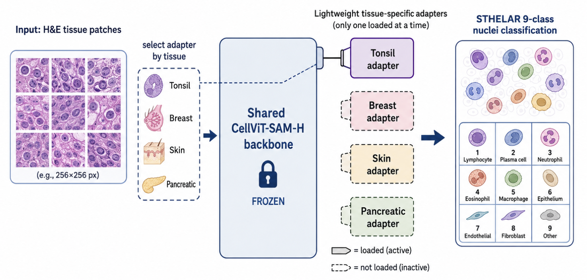

# STHELAR-Adapt

**Parameter-efficient adaptation of CellViT to STHELAR, a Xenium-based spatial transcriptomics dataset for H&E-guided nuclei segmentation and cell-type classification.**

  

STHELAR-Adapt adapts the CellViT foundation model to STHELAR, a multi-tissue dataset linking H&E histology patches, nucleus instance maps, and spatial-transcriptomics-derived cell-type annotations. The repository focuses on converting STHELAR Hugging Face Parquet data into a CellViT-compatible format and studying lightweight adaptation strategies, including LoRA, LoRA-NTOnly, and AdaptFormer adapters.

The long-term goal is to preserve a shared pretrained CellViT/SAM-H backbone while learning small tissue-specific adapters for STHELAR cell-type prediction.