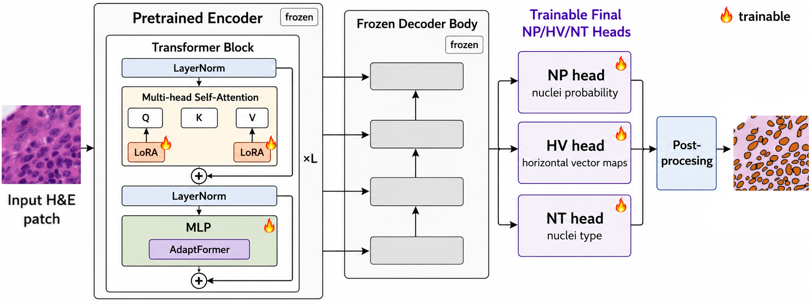
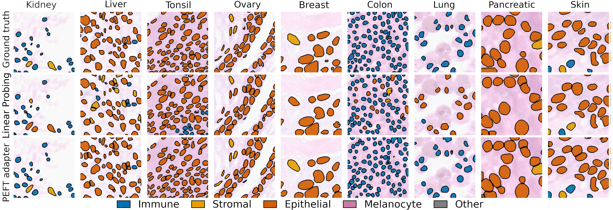

# STHELAR-Adapt

Parameter-efficient adaptation of CellViT-SAM-H x40 to STHELAR 40x H&E nuclei instance segmentation and five-class cell typing.

[COMPAYL 2026 paper (link pending)](#citation) · [Hugging Face adapters](https://huggingface.co/albtad01/STHELAR-Adapt-CellViT-SAM-H-x40) · [STHELAR paper](https://doi.org/10.1038/s41597-026-06937-6) · [STHELAR 40x data](https://huggingface.co/datasets/FelicieGS/STHELAR_40x) · [CellViT](https://github.com/TIO-IKIM/CellViT)

STHELAR pairs H&E tissue morphology with Xenium-derived cell annotations, enabling joint nuclei instance segmentation and five-class cell typing across nine tissues. Tissue-specific differences in morphology and label composition create domain shift, motivating adaptation beyond a fixed pretrained model.

STHELAR-Adapt tests whether CellViT-SAM-H x40 can be adapted to this setting without full fine-tuning. The selected strategy freezes the pretrained encoder base weights and decoder body while training LoRA rank-8 Q/V projections, AdaptFormer bottlenecks, and the final NP, HV, and NT heads. It updates approximately 1.12% of model parameters and recovers 94.96% of FullFT KLT mPQ. This repository provides preprocessing, leakage-safe spatial splitting, experiment configs, evaluation utilities, release tools, and verified Hugging Face adapter packages.

## Highlights

- Joint nuclei instance segmentation and five-class cell typing across nine STHELAR tissues.
- Selected LoRA Q/V + AdaptFormer + NP/HV/NT adaptation with frozen encoder base weights and decoder body.
- Approximately 1.12% trainable parameters while recovering 94.96% of FullFT KLT mPQ.
- Reproducible preprocessing, spatial splits, configs, evaluation, and adapter release tooling.
- Twelve verified KLT and tissue-specific safetensors adapter packages on Hugging Face.

<p align="center">
  
</p>

## Key results

All values below are final test results from the checked-in paper tables. KLT results are reported as the mean over seeds 42 and 43.

| KLT method | Trainable modules | Trainable | mPQ | bPQ | F1 detection | F1 type |
|---|---|---:|---:|---:|---:|---:|
| Final-head linear probe | NP/HV/NT heads | <0.01% | 0.204 | 0.446 | 0.818 | 0.430 |
| Full fine-tuning | All weights | 100% | 0.309 | 0.515 | 0.829 | 0.666 |
| Selected PEFT | LoRA Q/V + AdaptFormer + NP/HV/NT heads | 1.12% | 0.294 | 0.504 | 0.835 | 0.578 |

| Tissue-specific mean (9 tissues) | mPQ | F1 detection | F1 type |
|---|---:|---:|---:|
| Full fine-tuning | 0.2822 | 0.8001 | 0.6530 |
| Selected PEFT | 0.2755 | 0.8165 | 0.6056 |

See [the final KLT table](reports/paper_tables/klt_ablation_final_with_type_metrics.csv) and [the tissue table](reports/paper_tables/tissue_specific_compayl2026_final.csv) for the complete values and aggregation policy.

## Quick start

The normal user workflow uses released safetensors packages; it does not require access to or conversion of the original training checkpoints.

1. Clone STHELAR-Adapt and create the documented environment:

   ```bash
   git clone https://github.com/albtad01/STHELAR-Adapt.git
   cd STHELAR-Adapt
   conda env create -f environment.yml
   conda activate cellvit
   python -m pip install torch
   python -m pip install -r requirements.txt
   ```

2. Download the [official CellViT-SAM-H x40 checkpoint](https://drive.usercontent.google.com/download?id=1MvRKNzDW2eHbQb5rAgTEp6s2zAXHixRV&export=download&authuser=0) and verify its SHA256:

   ```bash
   sha256sum /path/to/CellViT-SAM-H-x40.pth
   # b324c10fddb0f80f5ab03a0459453a4c4848866934daf63435b46749a6b278cf
   ```

   The base checkpoint is required for reconstruction but is not redistributed here. Users must comply with its applicable terms.

3. Download one adapter package and its matching config from the Hugging Face model repository:

   ```python
   from huggingface_hub import snapshot_download

   snapshot_download(
       repo_id="albtad01/STHELAR-Adapt-CellViT-SAM-H-x40",
       local_dir="sthelar-adapt-release",
       allow_patterns=[
           "adapters/klt/seed42/*",
           "configs/release/compayl2026/klt/"
           "training_sthelar40x_kidney_liver_tonsil_5class_spatial_margin128_"
           "lora_adaptformer_r8_a8_red16_decoder_heads_only_lr5e-5_e10_seed42_CLEAN.yaml",
           "scripts/verify_released_adapter.py",
       ],
   )
   ```

4. Verify the package, then load it as shown in [Loading adapter packages](#loading-adapter-packages):

   ```bash
   python sthelar-adapt-release/scripts/verify_released_adapter.py \
     sthelar-adapt-release/adapters/klt/seed42 \
     --base-checkpoint /path/to/CellViT-SAM-H-x40.pth
   ```

## Qualitative results



Ground-truth overlays (top), final-head linear-probing predictions (middle), and selected LoRA+AdaptFormer plus final-head predictions (bottom) for one chosen patch from each of kidney, liver, tonsil, ovary, breast, colon, lung, pancreatic, and skin. Examples were selected for qualitative illustration and are not intended to constitute a statistically representative sample.

## Installation

Python 3.9 is the documented environment. Install PyTorch separately for the intended CPU/CUDA platform, then install the repository dependencies:

```bash
conda env create -f environment.yml
conda activate cellvit
python -m pip install torch
python -m pip install -r requirements.txt
```

The [official `CellViT-SAM-H-x40.pth` checkpoint](https://drive.usercontent.google.com/download?id=1MvRKNzDW2eHbQb5rAgTEp6s2zAXHixRV&export=download&authuser=0) is required for training and model reconstruction but is not included or redistributed here. The verified file has SHA256 `b324c10fddb0f80f5ab03a0459453a4c4848866934daf63435b46749a6b278cf`. Place a terms-compliant copy at `models/pretrained/CellViT-SAM-H-x40.pth`, or pass its path to the adapter loader. Users are responsible for complying with the base checkpoint's applicable terms.

## Dataset preparation and leakage-safe splitting

Download or materialize the STHELAR 40x Hugging Face Parquet dataset, then set local roots. `${STHELAR_ROOT}` and `${DATA_ROOT}` are expanded by the config loaders and fail if unresolved.

```bash
export STHELAR_ROOT=/path/to/STHELAR_40x
export DATA_ROOT=/path/to/cellvit_ready

python preprocessing/sthelar/convert_hf_to_cellvit.py \
  --config configs/release/compayl2026/preprocessing/preprocessing_sthelar40x_kidney_liver_tonsil_5class_spatial_margin128.yaml

python utils/check_spatial_split_leakage.py \
  --dataset "$DATA_ROOT/sthelar40x_kidney_liver_tonsil_5class_spatial_margin128" \
  --config configs/release/compayl2026/preprocessing/preprocessing_sthelar40x_kidney_liver_tonsil_5class_spatial_margin128.yaml \
  --output-dir reports/split_checks
```

The spatial splitter assigns within-slide train/validation/test regions along a coordinate axis and discards patches in a 128-coordinate-unit band around boundaries. Inspect `split_manifest.yaml`, `patch_info_with_split.csv`, and the leakage-check CSV before training. The other paper preprocessing configs are under `configs/release/compayl2026/preprocessing/`.

The released label mapping contains five foreground types plus background:

| ID | Label |
|---:|---|
| 0 | Background |
| 1 | Immune |
| 2 | Stromal |
| 3 | Epithelial |
| 4 | Melanocyte |
| 5 | Other |

All curated configs set `num_tissue_classes: 1`. CellViT's one-output tissue classifier is retained for compatibility with the inherited architecture, trainer interface, and packaged state. With a single output, its softmax prediction and cross-entropy objective are degenerate; tissue classification is not a reported task. The paper results evaluate the NP, HV, and NT nuclei outputs.

## Training

These commands are intentionally not run as part of a repository audit; they require the dataset, the base checkpoint, and suitable GPU resources.

```bash
# Final NP/HV/NT-head linear probe
python cell_segmentation/run_cellvit.py --config \
  configs/release/compayl2026/klt/training_sthelar40x_kidney_liver_tonsil_5class_spatial_margin128_klt_final_heads_only_frozen_encoder_decoder_e10_seed42.yaml

# Selected PEFT, seed 42 (repeat with the adjacent seed-43 config)
python cell_segmentation/run_cellvit.py --config \
  configs/release/compayl2026/klt/training_sthelar40x_kidney_liver_tonsil_5class_spatial_margin128_lora_adaptformer_r8_a8_red16_decoder_heads_only_lr5e-5_e10_seed42_CLEAN.yaml

# Full fine-tuning, seed 42 (repeat with the adjacent seed-43 config)
python cell_segmentation/run_cellvit.py --config \
  configs/release/compayl2026/klt/training_sthelar40x_kidney_liver_tonsil_5class_spatial_margin128_fullft_lr1e-5_e10_seed42_CLEAN.yaml
```

Tissue-specific FullFT and selected-PEFT configs are in `configs/release/compayl2026/tissue_specific/`. The paper used seed 42 except Pancreatic and Tonsil (seed 43); Kidney PEFT is the mean of seeds 42 and 43.

## Inference and evaluation

Training invokes patch inference after the final epoch. To rerun inference without retraining:

```bash
python utils/rerun_cellvit_inference.py \
  --run_dir /path/to/timestamped/run \
  --checkpoint_name model_best.pth \
  --gpu 0 --magnification 40
```

To rebuild the run summaries and paper tables from local run logs:

```bash
python utils/collect_sthelar_run_tables_v2.py --run-root run \
  --out-summary reports/runs_summary.csv --out-epochs reports/epoch_metrics.csv
python utils/analysis/create_final_type_metric_tables.py
```

Aggregate paper tables are tracked. Some prediction-level artifacts and timestamped runs required for complete figure and QC regeneration are not included; see [the public release audit](reports/public_release_audit.md) for details.

## Loading adapter packages

Download a safetensors adapter directory and its matching YAML config from the Hugging Face model repository, reconstruct the matching base, and load one adapter at a time:

```python
from utils.cellvit_adapter_hub import load_cellvit_base, load_sthelar_adapter

model = load_cellvit_base(
    model_name="cellvit-sam-h-x40",
    base_checkpoint="/path/to/CellViT-SAM-H-x40.pth",
    config_path="configs/release/compayl2026/klt/"
                "training_sthelar40x_kidney_liver_tonsil_5class_spatial_margin128_"
                "lora_adaptformer_r8_a8_red16_decoder_heads_only_lr5e-5_e10_seed42_CLEAN.yaml",
)
load_sthelar_adapter(model, "sthelar-adapt-release/adapters/klt/seed42")
```

Normal users should not convert legacy `.pth` checkpoints. Verify downloaded packages with `tools/verify_released_adapter.py` or the identical script included in the model repository.

## Maintainer utilities

The original `.pth` files are private release inputs. Maintainers may convert only a checkpoint approved in [the internal audit manifest](release/adapter_manifest.csv); the exporter refuses to overwrite an existing package.

```bash
python tools/export_adapter_safetensors.py /path/to/approved_adapter.pth \
  /path/to/new/package-directory \
  --adapter-id klt/seed42 \
  --source-config configs/release/compayl2026/klt/<matching-config>.yaml \
  --base-checkpoint-sha256 b324c10fddb0f80f5ab03a0459453a4c4848866934daf63435b46749a6b278cf
```

## Verified adapter inventory

All 12 adapter packages passed conversion, exact tensor round-trip, metadata, base-loading, and 256×256 CPU forward checks. Exact source/config/export hashes are frozen in [the verified release manifest](release/huggingface/adapter_manifest_verified.csv); the broader 51-checkpoint audit remains in [the audit manifest](release/adapter_manifest.csv). No full CellViT base weights belong in the adapter release.

| Public adapter ID | Tissue(s) | Seed |
|---|---|---:|
| `klt/seed42` | Kidney + Liver + Tonsil | 42 |
| `klt/seed43` | Kidney + Liver + Tonsil | 43 |
| `tissue_specific/breast/seed42` | Breast | 42 |
| `tissue_specific/colon/seed42` | Colon | 42 |
| `tissue_specific/kidney/seed42` | Kidney | 42 |
| `tissue_specific/kidney/seed43` | Kidney | 43 |
| `tissue_specific/liver/seed42` | Liver | 42 |
| `tissue_specific/lung/seed42` | Lung | 42 |
| `tissue_specific/ovary/seed42` | Ovary | 42 |
| `tissue_specific/pancreatic/seed43` | Pancreatic | 43 |
| `tissue_specific/skin/seed42` | Skin | 42 |
| `tissue_specific/tonsil/seed43` | Tonsil | 43 |

## Repository structure

| Path | Role |
|---|---|
| `preprocessing/sthelar/` | STHELAR Parquet inspection and CellViT conversion |
| `cell_segmentation/`, `models/`, `base_ml/`, `datamodel/` | inherited CellViT framework plus STHELAR/adapter extensions |
| `configs/release/compayl2026/` | curated preprocessing and training configurations |
| `utils/` | evaluation, analysis, checkpoint, and adapter utilities |
| `tools/` | public adapter audit, conversion, and verification tools |
| `reports/`, `figures/paper_figures/`, `docs/figures/` | selected metrics, audits, the publication architecture source, and synchronized figures |
| `ruche/`, `jeanzay/` | optional, cluster-specific SLURM examples; not required locally |
| `release/huggingface/` | Hugging Face adapter-release metadata, configs, scripts, results, and synchronized figures |

## Limitations

- Evaluation uses few slides per tissue and within-slide spatial splits; spatial separation does not establish cross-site generalization.
- STHELAR cell labels are derived from spatial transcriptomics and retain assignment uncertainty.
- Selected PEFT nearly recovers FullFT mPQ but retains a gap in cell-type F1.
- The work is for research use only and is not validated for clinical diagnosis or treatment.
- The base checkpoint is required but not redistributed; users must comply with its applicable terms and the repository license notices.

## Citation

Please cite the STHELAR-Adapt COMPAYL paper when its final bibliographic record is available, together with the underlying works:

```bibtex
@article{hoerst2024cellvit,
  title   = {CellViT: Vision Transformers for Precise Cell Segmentation and Classification},
  author  = {Hörst, Fabian and others},
  journal = {Medical Image Analysis},
  volume  = {94},
  pages   = {103143},
  year    = {2024},
  doi     = {10.1016/j.media.2024.103143}
}

@article{giraudsauveur2026sthelar,
  title   = {STHELAR, a Multi-Tissue Dataset Linking Spatial Transcriptomics and Histology for Cell Type Annotation},
  author  = {Giraud-Sauveur, Felicie and others},
  journal = {Scientific Data},
  year    = {2026},
  doi     = {10.1038/s41597-026-06937-6}
}

@inproceedings{kirillov2023segment,
  title  = {Segment Anything},
  author = {Kirillov, Alexander and others},
  booktitle = {ICCV},
  year   = {2023}
}
```

## License and acknowledgements

This repository inherits substantial code and documentation from CellViT. The preserved upstream README is [README_CellViT.md](README_CellViT.md), and the repository currently carries CellViT's [Apache 2.0 with Commons Clause notice](LICENSE). Do not assume that STHELAR's CC BY 4.0 data license automatically applies to this code, adapters, SAM-derived components, or the CellViT base checkpoint. The release audit lists the licensing questions that must be resolved before publishing weights.
