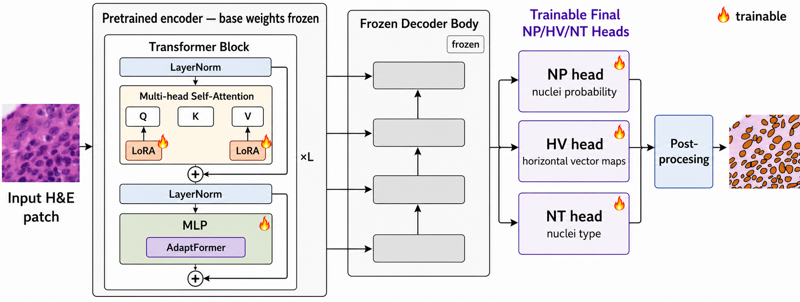

# STHELAR-Adapt — draft model card

> **Verified release candidate.** All 12 canonical adapters have passed conversion, exact round-trip equality, model loading, forward smoke, and metadata checks. The CellViT-SAM-H x40 base checkpoint is not redistributed.



## Model summary

STHELAR-Adapt provides adapter-only weights for adapting CellViT-SAM-H x40 to STHELAR 40x H&E nuclei instance segmentation and five-class cell-type classification. It is not a standalone model and does not include the frozen CellViT/SAM-H base checkpoint.

The selected method freezes the CellViT-SAM-H x40 encoder base weights and decoder body while training:

- LoRA rank 8, alpha 8, dropout 0 on every encoder attention Q and V projection;
- AdaptFormer bottlenecks with reduction 16 and GELU in encoder MLP blocks;
- final NP (nuclei probability), HV (horizontal/vertical), and NT (nuclei type) output heads.

The selected configuration has 7,908,779 trainable parameters, approximately 1.1176% of the full model. Mutable BatchNorm buffers needed for exact reconstruction are packaged separately from trainable state keys inside each safetensors file.

## Exact base requirement

- Architecture/checkpoint name: `CellViT-SAM-H-x40.pth`
- Model family: CellViT-SAM-H x40
- Backbone: SAM-H, 32 blocks, embedding dimension 1280, 16 attention heads
- Input: normalized RGB 256×256 STHELAR 40x patches

The base checkpoint is **not included or redistributed**. The locally verified checkpoint SHA256 is `b324c10fddb0f80f5ab03a0459453a4c4848866934daf63435b46749a6b278cf`. The authoritative download location, license terms, and release identifier still require manual verification; a filename match alone is insufficient for compatibility.

## Intended uses

- Research reproduction of the COMPAYL 2026 STHELAR-Adapt experiments.
- Research evaluation of nuclei instance segmentation and the declared STHELAR five-class mapping on matching 40x preprocessing/splits.
- Study of tissue-specific parameter-efficient adaptation of CellViT.

## Out-of-scope uses

- Clinical diagnosis, prognosis, treatment selection, or autonomous pathology reporting.
- Patient-level decision making or deployment without independent validation and governance.
- Images from unvalidated tissues, stains, scanners, magnifications, institutions, or preprocessing pipelines.
- Treating spatial-transcriptomics-derived labels as error-free pathology ground truth.
- Loading an adapter with a different base checkpoint, label order, number of classes, or adapter architecture.

## Training data

Adapters were trained on the public [STHELAR 40x Hugging Face dataset](https://huggingface.co/datasets/FelicieGS/STHELAR_40x), derived from Xenium spatial transcriptomics paired with H&E imagery. Experiments cover kidney, liver, tonsil, ovary, breast, colon, lung, pancreatic, and skin tissues. KLT combines kidney, liver, and tonsil.

The release configs use within-slide spatial train/validation/test regions with a 128-coordinate-unit boundary exclusion band. Some tissue configs cap each slide at 50,000 patches before splitting. The exact dataset revision and file hashes must be added before upload.

### Label mapping

The task has five foreground classes plus background:

| ID | Label |
|---:|---|
| 0 | Background |
| 1 | Immune |
| 2 | Stromal |
| 3 | Epithelial |
| 4 | Melanocyte |
| 5 | Other |

`num_nuclei_classes` is therefore 6. All release configs set `num_tissue_classes: 1`. The inherited CellViT tissue classifier is retained for architecture/trainer-interface and packaged-state compatibility. A one-output softmax and cross-entropy objective are degenerate, and tissue classification is not part of the reported task; reported metrics evaluate the NP, HV, and NT nuclei outputs.

## Training configuration

Selected PEFT runs use AdamW, learning rate `5e-5`, betas `[0.85, 0.85]`, batch size 4, 10 epochs, mixed precision, cell-aware sampling with gamma 0.85, and the augmentations recorded in `configs/release/compayl2026/`. KLT results are reported as the mean over seeds 42 and 43. Tissue results use seed 42 except Pancreatic and Tonsil (seed 43); Kidney PEFT averages seeds 42 and 43.

The selected checkpoint in each source adapter metadata is `model_best.pth`; the stored metadata records the validation selection state. Final reported numbers below are test metrics and were not used as the selection criterion.

## Results

### KLT headline

| Method | Trainable | mPQ | bPQ | F1 detection | F1 type (present classes) |
|---|---:|---:|---:|---:|---:|
| FullFT | 100% | 0.3092 | 0.5147 | 0.8286 | 0.6661 |
| Selected LoRA+AF + heads | 1.1176% | 0.2936 | 0.5043 | 0.8345 | 0.5783 |

The selected PEFT method recovers 94.96% of FullFT KLT mPQ. `results/klt_ablation_final_with_type_metrics.csv` contains the full ablation table and definitions.

### Tissue-specific results

| Tissue | FullFT mPQ | PEFT mPQ | PEFT F1 detection | PEFT F1 type | Adapter seed(s) |
|---|---:|---:|---:|---:|---|
| Liver | 0.4124 | 0.3925 | 0.8916 | 0.5673 | 42 |
| Kidney | 0.2592 | 0.2484 | 0.8332 | 0.5013 | 42, 43 mean |
| Ovary | 0.3195 | 0.2999 | 0.8414 | 0.6182 | 42 |
| Breast | 0.3481 | 0.3348 | 0.8424 | 0.5873 | 42 |
| Colon | 0.2057 | 0.2047 | 0.7904 | 0.6076 | 42 |
| Lung | 0.3225 | 0.3015 | 0.8637 | 0.6271 | 42 |
| Pancreatic | 0.2118 | 0.2389 | 0.7383 | 0.6682 | 43 |
| Skin | 0.2107 | 0.2239 | 0.7250 | 0.6778 | 42 |
| Tonsil | 0.2498 | 0.2346 | 0.8226 | 0.5955 | 43 |
| Mean | 0.2822 | 0.2755 | 0.8165 | 0.6056 | across tissues |

See `results/tissue_specific_compayl2026_final.csv` for unrounded values and aggregation policy.

## Adapter inventory

The release candidate contains 12 adapter-only files: KLT seeds 42/43; Breast 42; Colon 42; Kidney 42/43; Liver 42; Lung 42; Ovary 42; Pancreatic 43; Skin 42; and Tonsil 43. [`adapter_manifest_verified.csv`](adapter_manifest_verified.csv) freezes stable public IDs, exact source/config/export SHA256 values, tensor structure, and verification status; [`verification_summary.json`](verification_summary.json) records the environment and full test outcomes.

No ablation, failed, retest, duplicate-named alternate run, or full base checkpoint belongs in the canonical set.

## Download and load

This repository distributes safetensors adapter packages. Normal users download a package; they do not convert the original `.pth` training checkpoints. From a clone of the STHELAR-Adapt code repository, download one adapter and its matching config:

```python
from huggingface_hub import snapshot_download

release_root = snapshot_download(
    repo_id="albtad01/STHELAR-Adapt-CellViT-SAM-H-x40",
    local_dir="sthelar-adapt-release",
    allow_patterns=[
        "adapters/klt/seed42/*",
        "configs/release/compayl2026/klt/"
        "training_sthelar40x_kidney_liver_tonsil_5class_spatial_margin128_"
        "lora_adaptformer_r8_a8_red16_decoder_heads_only_lr5e-5_e10_seed42_CLEAN.yaml",
        "scripts/verify_released_adapter.py",
    ],
)
```

First verify the downloaded adapter package without a base checkpoint:

```bash
python sthelar-adapt-release/scripts/verify_released_adapter.py \
  sthelar-adapt-release/adapters/klt/seed42
```

Then use the STHELAR-Adapt repository to reconstruct the base and load one adapter:

```python
from utils.cellvit_adapter_hub import load_cellvit_base, load_sthelar_adapter

release_root = "sthelar-adapt-release"
model = load_cellvit_base(
    model_name="cellvit-sam-h-x40",
    base_checkpoint="/path/to/CellViT-SAM-H-x40.pth",
    config_path=f"{release_root}/configs/release/compayl2026/klt/"
                "training_sthelar40x_kidney_liver_tonsil_5class_spatial_margin128_"
                "lora_adaptformer_r8_a8_red16_decoder_heads_only_lr5e-5_e10_seed42_CLEAN.yaml",
    device="cpu",
)
load_sthelar_adapter(model, f"{release_root}/adapters/klt/seed42")
```

To validate compatibility and run a lightweight CPU forward pass, explicitly provide the local base:

```bash
python sthelar-adapt-release/scripts/verify_released_adapter.py \
  sthelar-adapt-release/adapters/klt/seed42 \
  --base-checkpoint /path/to/CellViT-SAM-H-x40.pth
```

Only one adapter should be loaded at a time. Reconstruct the base when changing architecture, decoder scope, or label mapping.

## Limitations

- There are limited slides per tissue; within-slide spatial splits do not measure cross-site or cross-patient generalization.
- ST-derived cell-type labels have assignment uncertainty and are not interchangeable with morphology-only annotations.
- A residual F1-type gap remains between selected PEFT and FullFT, even where detection F1 is comparable or higher.
- The heterogeneous `Other` class and absent/rare classes affect macro metrics.
- Ovary aggregate metrics have a documented slide-dominance caveat.
- Performance may shift with scanner, stain, tissue, magnification, patch sampling, QC threshold, or base-checkpoint version.
- Research use only; no clinical validation has been performed.

## Ethical and clinical considerations

Errors can miss nuclei, merge/split instances, or assign incorrect cell types, potentially biasing downstream biological conclusions. Tissue and site imbalance can produce uneven performance across populations and laboratories. Users should inspect per-class/per-slide errors, validate on their intended cohort, retain human oversight, and avoid clinical claims. Dataset privacy/de-identification and intended-use conditions remain the user's responsibility.

## Qualitative results


Rows show ground truth, final-head linear probing, and selected PEFT predictions for chosen patches across nine tissues. Examples were selected for qualitative illustration and are not intended to constitute a statistically representative sample.

## Citation

Please cite the final STHELAR-Adapt COMPAYL 2026 paper once its bibliographic record is available, as well as:

- Hörst et al., “CellViT: Vision Transformers for Precise Cell Segmentation and Classification,” *Medical Image Analysis* 94 (2024), 103143. DOI: 10.1016/j.media.2024.103143.
- Giraud-Sauveur et al., “STHELAR, a Multi-Tissue Dataset Linking Spatial Transcriptomics and Histology for Cell Type Annotation,” *Scientific Data* (2026). DOI: 10.1038/s41597-026-06937-6.
- Kirillov et al., “Segment Anything,” ICCV 2023.

## License

This release is distributed under the terms in [`LICENSE`](LICENSE):
**Apache License 2.0 with the Commons Clause**. This preserves the
restrictive upstream terms applied to the original CellViT code.

The CellViT-SAM-H x40 base checkpoint is not included and must be obtained
separately under its applicable terms.

STHELAR source data and source imagery remain licensed under CC BY 4.0.
The qualitative figures contain STHELAR-derived imagery with ground-truth
and model-prediction overlays added for this work. Please cite CellViT,
STHELAR, Segment Anything, and STHELAR-Adapt as described above.
